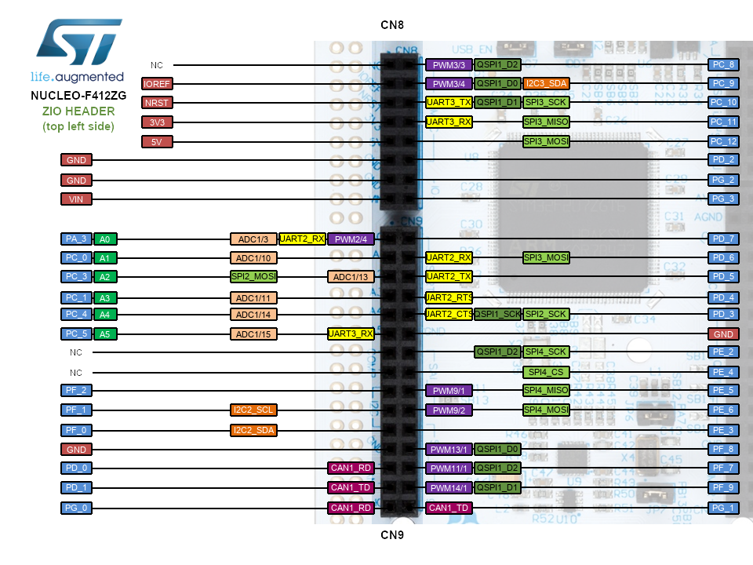
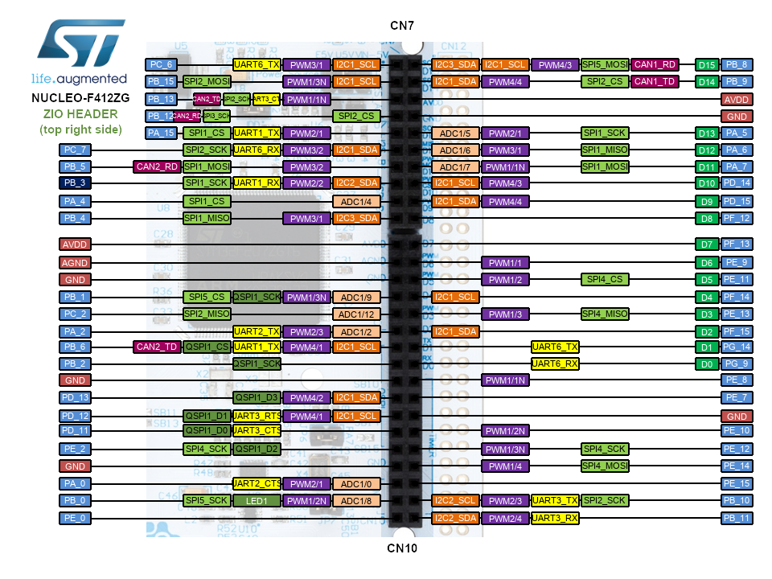
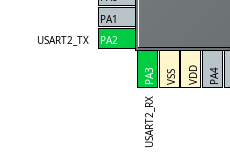

# TOTP Token
A hardware [TOTP](https://en.wikipedia.org/wiki/Time-based_one-time_password) token gadget made with STM32. 

---
- [TOTP Token](#totp-token)
  - [Features](#features)
  - [Getting Started](#getting-started)
    - [Software Requirements](#software-requirements)
      - [MacOS with `HomeBrew`](#macos-with-homebrew)
      - [Arch Linux](#arch-linux)
    - [Hardware Requirements](#hardware-requirements)
    - [Wiring](#wiring)
  - [Notes](#notes)
    - [Nucleo-F412ZG Pinout Reference](#nucleo-f412zg-pinout-reference)
    - [~~Interfacing with ESP32 (AT Firmware)~~ (Deprecated)](#interfacing-with-esp32-at-firmware-deprecated)
      - [Hardware Connection](#hardware-connection)
      - [Samples](#samples)
---
## Features
- [x] Data download over UART
  - [x] Serial data parsing
- [x] Data persistence with EEPROM Emulation
- [x] [Web app for TOTP service data management](https://github.com/mistrpokr/tinytotp-web)
- [ ] Epoch time tracking with RTC on battery
- [ ] PCB Design


## Getting Started
This project is primarily set up with STM32CubeMX and can be with `gcc` and `make`. 

### Software Requirements
- arm-none-eabi-gcc: Cross-compilation
- make: Building
- STM32CubeMX: Set up peripherals, clocks, ...
- openocd: GDB server over SWD

#### MacOS with [`HomeBrew`](https://brew.sh/)
- GNU Arm Embedded Toolchain [Version 10.3-2021.10](https://developer.arm.com/downloads/-/gnu-rm)
  > Note: Only x86_64 is available for MacOS; however it should execute without issue on an Apple Silicon MacBook with Rosetta 2. 
- make (Shipped with MacOS's Command Line Tools)
- openocd
- picocom
- [STM32CubeMX](https://www.st.com/en/development-tools/stm32cubemx.html)

#### Arch Linux
> Note: Development is no longer done on my Arch Linux device; that said, the build scheme should work as long as the dependencies are met. 

Install the following `pacman` packages. 
- arm-none-eabi-binutils 
- arm-none-eabi-gcc 
- arm-none-eabi-gdb 
- arm-none-eabi-newlib
- make
- openocd
- picocom
- stm32cubemx (AUR package)

Additionally **on Linux hosts**, [`bear`](https://github.com/rizsotto/Bear) can be used to generate `compile_commands.json` for VSCode C/C++ extension's IntelliSense. 

### Hardware Requirements
- [STM32 Nucleo-F412ZG](https://www.st.com/en/evaluation-tools/nucleo-f412zg.html)
<!-- - [ESP32-C3-DevKit](https://github.com/wuxx/nanoESP32-C3) (should work with any ESP32-C3 modules) -->
- ST7735S TFT Display (1.8 inch, 160x128) from AliExpress/Taobao
- Breadboard
- Jumpers

### Wiring
<!-- TODO -->

---
## Notes

### Nucleo-F412ZG Pinout Reference



### ~~Interfacing with ESP32 (AT Firmware)~~ (Deprecated)
> In early designs, an ESP32 was included to access servers for data synching, but was removed as it introduces unnecessary complexities and the same function can be achieved with a simple browser application. 
- ESP32 (AT Firmware) echoes serial input. 
- AT command responses end with CR+LF. 
#### Hardware Connection
STM32 communicates with ESP32 over its USART2 interface. USART2, as of the time this document is written, uses the GPIOs PA2/3. 



| STM32                   | Opt.1: ESP32 | Opt.2: USB-TTL (PC) |
| ----------------------- | ------------ | ------------------- |
| CN9 - A0(RX, PA3)       | D7(USART1TX) | TX                  |
| CN10 - ADC1/2 (TX, PA2) | D6(USART1RX) | RX                  |

#### Samples
```
at

OK
at+gmr
AT version:2.4.0.0(4c6eb5e - ESP32C3 - May 20 2022 03:11:59)
SDK version:qa-test-v4.3.3-20220423
compile time(5641e0a):May 20 2022 11:13:44
Bin version:2.4.0(MINI-1)

OK
```


https://www.eevblog.com/forum/microcontrollers/eeprom-emulation-stm32f4-flash-vs-external-flash-chip/